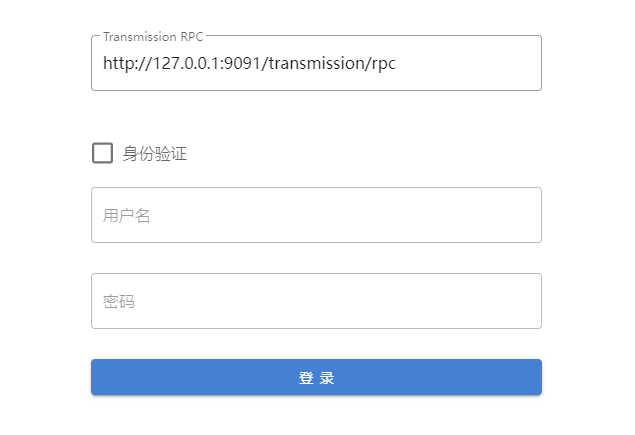
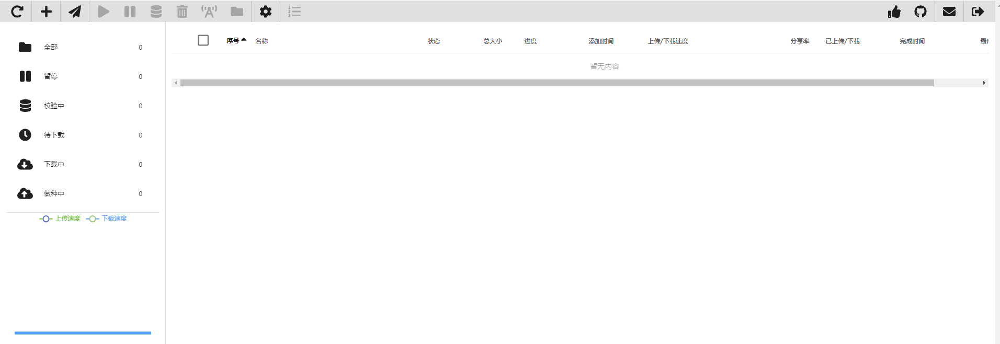

## Transmission Web UI

[](#)
[](#)
[](#)
[](#)
[](#)

### 介绍
本项目是基于 Transmission RPC 接口
并采用Vue框架编写了前端UI界面

主要功能有

:heavy_check_mark: 添加/删除种子

:heavy_check_mark: 查看/管理种子列表

:heavy_check_mark: 查看/管理下载文件及文件类型筛选/过滤

:heavy_check_mark: 管理文件优先级

:heavy_check_mark: 新增/删除Tracker

:heavy_check_mark: 控制下载/上传速度。

:heavy_check_mark: IP地理位置查询 [ipinfo](https://ipinfo.io) 支持

:heavy_check_mark: **浏览器扩展支持选中/链接右键快速下载**

### 安装方法

#### 1.替换默认安装

进入 transmission web 目录 /transmission/web
```shell script
# 下载编译后文件
wget https://github.com/zpqsunny/Transmission-Web-UI/releases/download/v2.1.0/release-v2.1.0.zip
# 重命名原transmission 默认index
mv index.html index.html.bak
unzip release-v2.0.3.zip
# 如果想恢复原来的 直接将备份的index.html.bak 重命名回index.html
```
#### 2.浏览器扩展安装

[](https://chrome.google.com/webstore/detail/transmission-web-ui/kbpnojigbmopjjhokfbdeejefhniedlo)
[](https://chrome.google.com/webstore/detail/transmission-web-ui/kbpnojigbmopjjhokfbdeejefhniedlo)
[](https://chrome.google.com/webstore/detail/transmission-web-ui/kbpnojigbmopjjhokfbdeejefhniedlo)

[](https://microsoftedge.microsoft.com/addons/detail/transmission-web-ui/lffaomgjiombjbglofglnmckpghnobom)
[](https://microsoftedge.microsoft.com/addons/detail/transmission-web-ui/lffaomgjiombjbglofglnmckpghnobom)
[](https://microsoftedge.microsoft.com/addons/detail/transmission-web-ui/lffaomgjiombjbglofglnmckpghnobom)

### 食用方法

首次使用时会进入登录界面

登录界面里设置Transmission RPC 的URL



如有身份验证勾选身份验证,并填写用户名和密码

如长时间无法获取种子信息时 点击最右上角退出重新进行登录操作



如配置正确下次打开默认自动进入种子管理界面

本项目配合Chromium内核浏览器开发插件食用,插件项目[chrome-extensions](https://github.com/zpqsunny/chrome-extensions)

如果您觉得这项目不错或对您有帮助请支持我

PayPal: zpqsunny#gmail.com


**感谢!**
